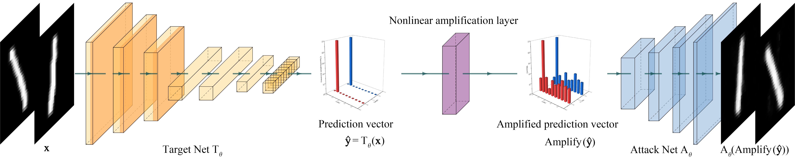

# Amplified-MIA - Official Pytorch Implementation

Official Pytorch implementation for paper: Z. Zhang, X. Wang, J. Huang and S. Zhang, "Analysis and Utilization of Hidden Information in Model Inversion Attacks," in IEEE Transactions on Information Forensics and Security, doi: [10.1109/TIFS.2023.3295942](https://doi.org/10.1109/TIFS.2023.3295942).



## Abstract

The widely applications of deep learning have raised concerns about the privacy issues in deep neural networks. Model inversion attack aims to reconstruct specific details of each private training sample from a given neural network. However, limited to the availability of useful information, reconstructing distinctive private training samples still has a long way to go. In this paper, the requirements to reconstruct distinctive private training samples are investigated using information entropy. We find that more information is needed to reconstruct distinctive samples and propose to use the often ignored hidden information to achieve this goal. To better utilize this information, Amplified-MIA is proposed. In Amplified-MIA, a nonlinear amplification layer is inserted between the target network and the attack network. This nonlinear amplification layer further contains a nonlinear amplification function. The definition of the nonlinear amplification function is given and the effect of this nonlinear amplification function on the entropy of the hidden information is derived. The proposed nonlinear amplification function can amplify the small prediction vector entries and enlarge the differences between different prediction vectors in the same class. Thus, the hidden information can be better utilized by the attack network and distinctive private samples can be reconstructed. Various experiments are performed to empirically analyze the effects of the nonlinear amplification function on the reconstruction results. The reconstruction results on three different datasets show that the proposed Amplified-MIA outperforms existing works on almost all tasks. Especially, it achieves up to 68% performance gain of the Pixel Accuracy score over the direct inversion method on the hardest face reconstruction task.

## Usage

### Hardware Requirements

Any Nvidia GPU with 8GB or larger memory is ok. The experiments were initially performed on a Nvidia Tesla V100 GPU using the HPC platform of Southeast University. Later experimets were performed on a PC with a Nvidia RTX 3080 GPU. The code supports both Windows and Linux environment.

### Required Runtime Libraries

* [Anaconda](https://www.anaconda.com/download/)
* [Pytorch](https://pytorch.org/) -- `conda install pytorch torchvision torchaudio pytorch-cuda=11.8 -c pytorch -c nvidia`
* [zhangzp9970/torchplus](https://github.com/zhangzp9970/torchplus) -- `conda install torchplus -c zhangzp9970`

The code is compatable with the latest version of all the software.

### Datasets

* MNIST -- `torchvision.datasets.MNIST(root[, train, transform, ...])`
* Fashion-MNIST -- `torchvision.datasets.FashionMNIST(root[, train, transform, ...])`
* FaceScrub -- can be downloaded and processed using [these scripts](https://github.com/lightalchemist/FaceScrub). Crop the images using the official bounding box is enough.

### File Description

* main_MNIST.py -- train the MNIST classifier.
* main_FaceScrub.py -- train the FaceScrub classifier.
* attack_MNIST.py -- perform Amplified-MIA attack against the trained MNIST classifier before.
* attack_FaceScrub.py -- perform Amplified-MIA attack against the trained FaceScrub classifier before.
* export_MNIST.py -- export the reconstructed images of the MNIST dataset.
* export_FaceScrub.py -- export the reconstructed images of the FaceScrub dataset.
* pixelloss_MNIST.py -- calculates the MSE, SSIM and Pixel Accuracy of the reconstructed images of the MNIST dataset.
* pixelloss_FaceScrub.py -- calculates the MSE, SSIM and Pixel Accuracy of the reconstructed images of the FaceScrub dataset.
* entropy_MNIST.py -- calculates the entropy of the hidden information in the prediction vectors.

The code can be directly runned without any parameters. All the parameters are defined in each python script seperately.

NOTE: For reproducing the results on Fashion-MNIST dataset, change the dataset function handles in MNIST codes.

## License

Copyright © 2023 Zeping Zhang

This program is free software: you can redistribute it and/or modify it under the terms of the GNU General Public License as published by the Free Software Foundation, either version 3 of the License, or (at your option) any later version.

This program is distributed in the hope that it will be useful, but WITHOUT ANY WARRANTY; without even the implied warranty of MERCHANTABILITY or FITNESS FOR A PARTICULAR PURPOSE. See the GNU General Public License for more details.

You should have received a copy of the GNU General Public License along with this program. If not, see [http://www.gnu.org/licenses/](http://www.gnu.org/licenses/).

## Citation

```
@ARTICLE{10184490,
  author={Zhang, Zeping and Wang, Xiaowen and Huang, Jie and Zhang, Shuaishuai},
  journal={IEEE Transactions on Information Forensics and Security}, 
  title={Analysis and Utilization of Hidden Information in Model Inversion Attacks}, 
  year={2023},
  volume={},
  number={},
  pages={1-1},
  doi={10.1109/TIFS.2023.3295942}
}

```

## Acknowledgements

We would like to thank Xuejin Zhu and other friends in the laboratory for useful comments and feedbacks. We also thank Xiangyang Zhang and Lianzhen Liu for their valuable advices that help us a lot. Besides, we thank professor Ming Chen for his help in calculating the differential entropy. Further, we thank the Big Data Center of Southeast University for providing the facility support on the numerical calculations in this paper. This work was supported by the National Key Research and Development Program of China (Grant No. 2018YFB2100403).

Especially, I would like to thank Zhouhong Wang and Hua Tong for their encouragement and support during the year and a half while I was waitting for the review results.
